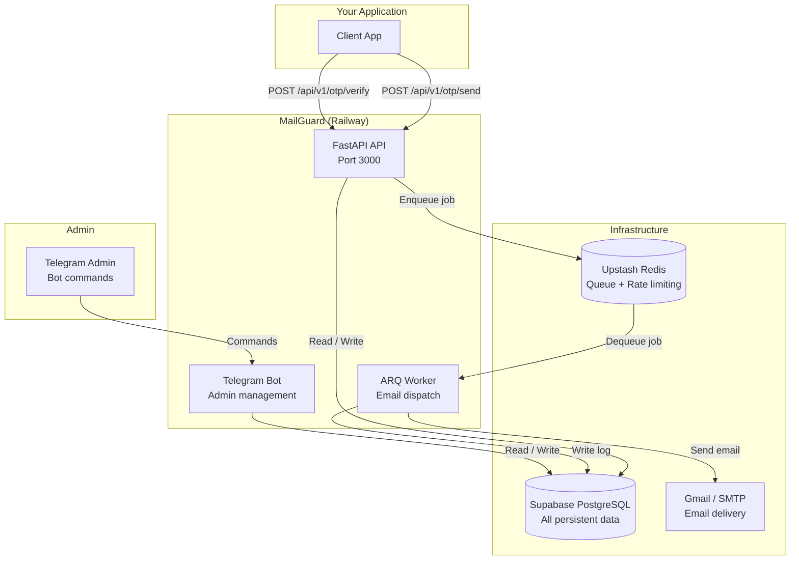

# MailGuard OSS – Python Edition

> **Self-hosted OTP & email automation server.**  
> FastAPI · ARQ · python-telegram-bot · Supabase · Upstash Redis · Railway

[](https://github.com/YOUR_ORG/mailguard/actions)
[](https://python.org)
[](./IDEANAX_OPEN_LICENSE.md)

---

## Overview

MailGuard is a production-ready, self-hosted service that:

- Sends time-limited, bcrypt-hashed OTP codes via transactional email.
- Verifies OTP codes and issues short-lived JWTs on success.
- Manages everything through a **Telegram admin bot** — no web dashboard needed.
- Protects recipient privacy by storing emails as HMAC-SHA256 digests.
- Runs as three independent services on [Railway](https://railway.app).

---

## Architecture



---

## Project Structure

```
mailguard/
├── apps/
│   ├── api/          # FastAPI REST API (OTP send/verify)
│   ├── worker/       # ARQ async worker (email dispatch)
│   └── bot/          # Telegram admin bot
├── core/             # Shared: config, crypto, DB, OTP, rate limiting
├── db/
│   └── migrations/   # PostgreSQL migration SQL files
├── tests/            # pytest test suite
├── docs/             # Guides and API docs
└── .github/
    └── workflows/    # CI/CD pipeline
```

---

## Quick Start

See [docs/quickstart.md](./docs/quickstart.md) for the full 6-step guide.

**TL;DR:**

```bash
# 1. Apply DB migrations in Supabase SQL Editor (db/migrations/*.sql)
# 2. Create Upstash Redis, copy TLS URL
# 3. Generate secrets:
python -c "import secrets; print(secrets.token_hex(32))"  # ENCRYPTION_KEY
python -c "import secrets; print(secrets.token_hex(64))"  # JWT_SECRET
# 4. Deploy to Railway (fork → connect repo → set env vars → deploy)
# 5. Use Telegram bot to add sender and create project
# 6. Make API calls
```

---

## Environment Variables

| Variable | Required | Description |
|----------|----------|-------------|
| `SUPABASE_URL` | ✅ | Supabase project URL |
| `SUPABASE_SERVICE_ROLE_KEY` | ✅ | Supabase service role key (keep secret) |
| `REDIS_URL` | ✅ | Redis connection URL (use `rediss://` for Upstash TLS) |
| `ENCRYPTION_KEY` | ✅ | 64 hex chars (32 bytes) for AES-256-GCM |
| `JWT_SECRET` | ✅ | Min 64-char secret for JWT signing |
| `TELEGRAM_BOT_TOKEN` | ✅ | From @BotFather |
| `TELEGRAM_ADMIN_UID` | ✅ | Your Telegram numeric user ID |
| `JWT_EXPIRY_MINUTES` | ❌ | Default: `10` |
| `ENV` | ❌ | `production` or `development` (default: `production`) |
| `PORT` | ❌ | API port (default: `3000`) |
| `ALLOWED_ORIGINS` | ❌ | CORS origins, comma-separated |

---

## API Reference

### Authentication

All API endpoints require:

```
Authorization: Bearer <api_key>
```

API keys are managed exclusively via the Telegram bot (`/genkey`).

---

### POST /api/v1/otp/send

Send an OTP to an email address.

**Request**

```json
{
  "email": "user@example.com",
  "purpose": "verification"
}
```

`purpose` must be one of: `verification`, `login`, `reset`, `confirmation`.

**Response 200**

```json
{
  "id": "550e8400-e29b-41d4-a716-446655440000",
  "status": "sent",
  "expires_in": 600,
  "masked_email": "us***@example.com"
}
```

**Error responses**

| Status | Code | Meaning |
|--------|------|---------|
| 401 | `MISSING_API_KEY` | No Bearer token |
| 401 | `INVALID_API_KEY` | Unknown or revoked key |
| 403 | `TEST_KEY_IN_PRODUCTION` | Sandbox key used in production |
| 403 | `PROJECT_INACTIVE` | Project is disabled |
| 422 | — | Invalid request body |
| 429 | `RATE_LIMIT_EXCEEDED` | Rate limit hit |

---

### POST /api/v1/otp/verify

Verify an OTP code.

**Request**

```json
{
  "email": "user@example.com",
  "code": "123456"
}
```

**Response 200**

```json
{
  "verified": true,
  "token": "<jwt>",
  "expires_in": 600
}
```

The JWT contains: `sub` (email HMAC), `project_id`, `otp_record_id`, `jti`, `iat`, `exp`.

**Error responses**

| Status | Code | Meaning |
|--------|------|---------|
| 400 | `INVALID_CODE` | Wrong OTP (includes `attempts_remaining`) |
| 410 | `OTP_NOT_FOUND` | No active OTP for this email |
| 410 | `OTP_EXPIRED` | OTP has expired |
| 423 | `OTP_LOCKED` | Too many failed attempts |

---

### GET /health

Returns `200` if Supabase and Redis are reachable, `503` otherwise.

```json
{
  "status": "ok",
  "checks": {
    "supabase": "ok",
    "redis": "ok"
  }
}
```

---

## Telegram Bot Commands

| Command | Description |
|---------|-------------|
| `/start` | Welcome message |
| `/help` | Full command reference |
| `/senders` | List sender emails |
| `/addemail` | Add sender email (wizard) |
| `/testsender <email>` | Send test email |
| `/removesender <email>` | Deactivate sender |
| `/projects` | List projects |
| `/newproject` | Create project (wizard) |
| `/assignsender <slug> <email>` | Assign sender to project |
| `/setotp <slug> <len> <exp> <max>` | Update OTP config |
| `/genkey <slug> [--sandbox]` | Generate API key |
| `/keys <slug>` | List API keys |
| `/revokekey <prefix>` | Revoke a key |
| `/testkey <key>` | Validate a key |
| `/logs` | Recent delivery logs |
| `/logs <slug>` | Logs for project |
| `/logs --failed` | Failed deliveries |
| `/logs --today` | Today's logs |
| `/cancel` | Cancel wizard |

---

## Rate Limiting

Five-tier sliding-window rate limits are enforced per OTP send request:

| Tier | Limit | Window |
|------|-------|--------|
| Global IP | 60 requests | 1 minute |
| Project + IP | 30 requests | 1 minute |
| Project + email | 5 requests | 1 hour |
| Project global | 1 000 requests | 1 hour |
| Sandbox project | 20 requests | 1 hour |

---

## Security Design

- **No PII stored in plaintext** – emails are stored as HMAC-SHA256.
- **OTP hashed with bcrypt** (cost 10) – offline brute-force is expensive.
- **SMTP passwords encrypted** with AES-256-GCM before storage.
- **API keys stored as SHA-256 hash only** – plaintext shown once.
- **Anti-enumeration**: all OTP endpoints enforce a minimum 200 ms response.
- **JWT with `jti`** allows token revocation if needed.
- **Sandbox key blocking** in production prevents accidental test data.
- See [SECURITY.md](./SECURITY.md) for the vulnerability disclosure policy.

---

## Running Tests

```bash
pip install -r requirements.txt
pytest -v
```

---

## Contributing

1. Fork the repository.
2. Create a feature branch: `git checkout -b feat/my-feature`.
3. Write tests for your changes.
4. Ensure `ruff check .` and `pytest` pass.
5. Open a pull request against `main`.

Please read [SECURITY.md](./SECURITY.md) before reporting security issues.

---

## License

[IDEANAX Open License](./IDEANAX_OPEN_LICENSE.md)
